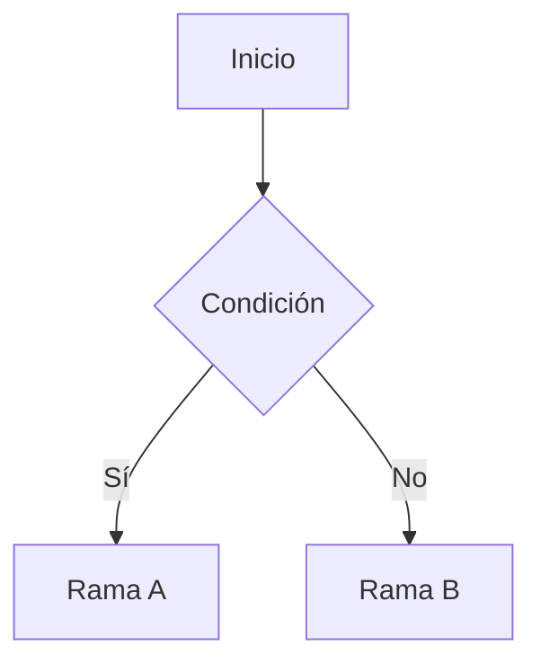

# Guía: Mermaid (borradores rápidos de diagramas)

Genera borradores rápidos de diagramas simples (flujo, secuencia, estados, clases) como texto Mermaid embebido en el Markdown. **SOLO para borradores**: su tema violeta no sigue el estilo v4 ni el modo oscuro, así que un diagrama que vaya en un resumen o material final se hace con SVG a mano o Graphviz.

Mermaid queda solo para borradores rápidos porque su tema violeta no sigue el estilo v4 (tinta, un acento azul, Alegreya Sans) ni el modo oscuro. Cuando un diagrama deba verse como el resto del sistema, que es lo normal en un resumen o material final, se hace con SVG a mano (diagramas chicos) o con `apoyo/graphviz-diagramas.md` y `apoyo/plantuml-diagramas.md` (grandes o UML formal), nunca con Mermaid. El tema no se adapta salvo que la persona lo pida.

## Cuándo usarla
Solo para un borrador rápido de un flujo, secuencia, máquina de estados o diagrama de clases simple, para fijar la idea antes de dibujarlo bien, o si la persona pide Mermaid expresamente. Un borrador no se entrega dentro de un resumen cerrado: se rehace en SVG o Graphviz antes de cerrar.

## Cómo se declara: texto dentro del Markdown, sin archivo aparte
A diferencia de Graphviz y PlantUML (que generan un `.svg` que después se referencia con ``), un diagrama Mermaid va **directo en el `.md` del resumen**, como bloque de código con el lenguaje `mermaid`:

````

````

El `.md` sigue siendo la fuente única: no hay ningún archivo de imagen que gestionar ni que se pueda desincronizar del texto.

## Sintaxis: solo lo que Mermaid v11 soporta bien
Usar los diagramas más simples y estables: `flowchart`, `sequenceDiagram`, `stateDiagram-v2`, `classDiagram`. Etiquetas cortas, sin HTML embebido dentro de un nodo. Tema por defecto de Mermaid: violeta claro, no adaptado al sistema visual v4.

## Qué tiene que hacer `generar-html` para que esto funcione
El encabezado de Mermaid (`sistema-visual/mermaid-init.html`, la librería completa embebida sin conexión, igual criterio que Paged.js: nunca por CDN) se agrega con `--include-in-header` **solo si el Markdown de ese resumen tiene al menos un bloque ` ```mermaid `**, nunca por defecto, porque agrega unos 3,4 MB al `.html` final. Ver el paso correspondiente en `apoyo/generar-html.md`.

Cuidado con `--syntax-highlighting` (resaltado de sintaxis de código): «mermaid» no es un lenguaje que el resaltador de Pandoc reconozca, así que el bloque sale como texto plano sin spans de color, que es lo que Mermaid necesita para poder leerlo tal cual. Si en algún momento se agrega un lenguaje de resaltado que sí reconozca «mermaid», hay que revisar que no rompa esto.

## Cómo se dibuja
`mermaid-init.html` no usa `startOnLoad`: dibuja a mano cada `pre.mermaid` con `mermaid.render` sobre `textContent` y deja la promesa `window.__mermaidListo`. Motivo: Pandoc escapa `-->` como `--&gt;` y Mermaid, que lee `innerHTML`, daba «Syntax error in text». No hace falta ningún posproceso con expresiones regulares. Funciona en los tres formatos: HTML completo, Hoja A4 (la página espera a `__mermaidListo` antes de paginar, ver `a4-pagina.html`) y Diapositivas HTML (los diagramas se dibujan fuera de pantalla, así que también salen bien en diapositivas ocultas). No está pensado para el Word: ahí un diagrama va como SVG (se pasa a PNG).

## Paso obligatorio después de generar: verificación visual con JavaScript habilitado
Mermaid dibuja el diagrama recién cuando corre el JavaScript en el navegador: no alcanza con mirar el Markdown ni el HTML crudo. Pasar por `apoyo/verificacion-visual.md` sobre el `.html` ya exportado (`sistema-visual/herramientas/captura_espera.py` sin `--rapida`, navegador sin interfaz que sí ejecuta JS) antes de dar el diagrama por bueno, con el mismo checklist que cualquier otro diagrama (texto completo, sin superposiciones, flechas legibles).
