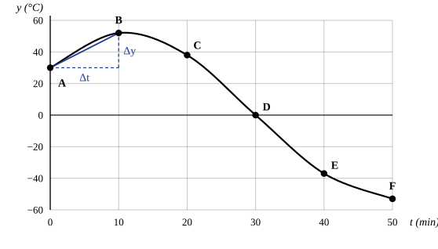

# Variación y tasa de cambio {unidad=3}

Para estudiar cómo evoluciona una magnitud con el tiempo sin complicarse, se mira cuánto cambió entre dos instantes y cuánto tiempo pasó entre ellos. La temperatura de una muestra, el nivel de un tanque o el saldo de una cuenta se pueden describir así: lo único que interesa es el valor en cada momento y cómo cambia de uno a otro.

Esta unidad solo describe el cambio. Las causas que lo provocan quedan fuera.

::: previas
1. Una muestra está a 20 °C, se calienta hasta 50 °C y vuelve a 20 °C. ¿Cuánto vale su variación neta?
2. ¿Puede ser negativa una tasa de variación promedio? ¿Y una tasa de variación total?
:::

## Valor y variación {#sec:valor}

::: {.definicion #def:valor titulo="valor de una magnitud"}
El valor de una magnitud en un instante es la lectura que se obtiene al medirla en ese momento, expresada en una unidad acordada. Se anota como una función del tiempo:
:::

::: {.ecuacion #ec:valor}
$$y = y(t)$$
:::

El tiempo $t$ se mide desde un instante de referencia que se elige como origen, y $y$ puede ser positivo, negativo o cero según la magnitud y la escala elegidas. En esta unidad se trabaja con la temperatura de una muestra, en grados Celsius, y el tiempo en minutos.

---

::: {.definicion #def:variacion titulo="variación neta"}
La variación neta es la diferencia entre el valor final y el inicial. Solo importan los dos extremos: lo que pasó entre ambos no cuenta. Puede ser positiva, negativa o cero:
:::

::: {.ecuacion #ec:variacion}
$$\Delta y = y_{f} - y_{i}$$
:::

Si la muestra se calienta, se enfría y vuelve a la temperatura de partida, la variación neta es cero aunque haya cambiado mucho en el medio.

---

La *historia* de una magnitud es la sucesión de valores por los que pasa mientras transcurre el tiempo. Si crece siempre o decrece siempre, la historia es monótona; si sube y baja, no lo es.^[La variación total recorrida es la suma de todos los cambios parciales, tomados en valor absoluto, y no debe confundirse con la variación neta.]

::: sintesis
El valor es lo que se mide en cada instante. La variación neta es la diferencia entre el valor final y el inicial, y no depende de lo ocurrido en el medio.
:::

## Tasa de variación promedio {#sec:tasa}

::: {.definicion #def:tasa titulo="tasa de variación promedio"}
La tasa de variación promedio de una magnitud es su variación neta dividida por el tiempo que tardó en producirse. Como la variación neta tiene signo, la tasa promedio también lo tiene: es positiva si la magnitud terminó más alta que como empezó y negativa en el caso contrario.
:::

::: clave
::: {.ecuacion #ec:tasa}
$$\bar{r} = \frac{\Delta y}{\Delta t} = \frac{y_{f} - y_{i}}{t_{f} - t_{i}}$$
:::
:::

Se mide en la unidad de la magnitud sobre la unidad de tiempo: en el ejemplo, grados Celsius por minuto.

---

Para trabajar con números, sea una muestra cuya temperatura se anota cada 10 min. La  reúne esos datos y la  los dibuja como gráfica de temperatura en función del tiempo.

::: {#tbl:muestra}
| Medición | $t$ (min) | $y$ (°C) |
|:--------:|----------:|---------:|
| A        |         0 |       30 |
| B        |        10 |       52 |
| C        |        20 |       38 |
| D        |        30 |        0 |
| E        |        40 |      −37 |
| F        |        50 |      −53 |

Table: Temperatura de la muestra en varios instantes.
:::

---

{#fig:yt}

---

::: {.ejemplo #ej:af titulo="tasa promedio entre A y F"}
Calcular la tasa de variación promedio de la temperatura entre las mediciones A y F de la .

::: resolucion
Se toman el valor y el tiempo de los dos extremos del intervalo y se aplica la :

$$\begin{aligned} \bar{r} &= \frac{y_{F} - y_{A}}{t_{F} - t_{A}} \\ &= \frac{-53\ \text{°C} - 30\ \text{°C}}{50\ \text{min} - 0\ \text{min}} \\ &= \frac{-83\ \text{°C}}{50\ \text{min}} = -1{,}7\ \frac{\text{°C}}{\text{min}} \end{aligned}$$

El signo negativo indica que, en neto, la temperatura bajó.
:::
:::

---

Sobre la gráfica, la tasa promedio es la pendiente de la recta que une dos puntos: esa recta es la hipotenusa de un triángulo rectángulo de altura $\Delta y$ y base $\Delta t$. Entre A y B la pendiente vale

$$\frac{52\ \text{°C} - 30\ \text{°C}}{10\ \text{min} - 0\ \text{min}} = 2{,}2\ \frac{\text{°C}}{\text{min}}$$

Dos propiedades para tener presentes:

- No depende de la historia de la magnitud entre los dos puntos, porque es proporcional a la variación neta.
- Su módulo no es la tasa de variación total, que se define en la .

::: sintesis
La tasa de variación promedio es la variación neta sobre el intervalo de tiempo, o sea la pendiente de la recta entre dos puntos de la gráfica del valor en función del tiempo.
:::

## Tasa de variación total {#sec:total}

En el lenguaje cotidiano «cuánto cambió» y «cuánto varió en total» se usan como si fueran lo mismo, pero no lo son: la variación neta tiene signo y se compensa; la variación total no. Una muestra que sube 30 °C y después baja 30 °C tiene variación neta cero, aunque haya cambiado mucho.

::: {.definicion #def:total titulo="tasa de variación total"}
La tasa de variación total de una magnitud es siempre positiva: la suma de los valores absolutos de todos los cambios parciales dividida por el tiempo total.
:::

::: {.ecuacion #ec:total}
$$\bar{r}_{T} = \frac{\sum \left|\Delta y_{k}\right|}{\Delta t}$$
:::

---

::: {.ejemplo #ej:total titulo="tasa total entre A y F"}
Calcular la tasa de variación total de la temperatura de la  entre A y F.

::: resolucion
La muestra sube 22 °C de A a B y baja 105 °C de B a F, en total 127 °C. Con la :

$$\bar{r}_{T} = \frac{127\ \text{°C}}{50\ \text{min}} = 2{,}5\ \frac{\text{°C}}{\text{min}}$$
:::
:::

---

::: {#tbl:comparacion}
| Magnitud                   | Signo       | Se calcula como                   | Muestra, de A a F                      |
|----------------------------|-------------|-----------------------------------|----------------------------------------|
| Tasa de variación promedio | Con signo   | variación neta sobre tiempo       | $-1{,}7\ \frac{\text{°C}}{\text{min}}$ |
| Tasa de variación total    | Siempre ≥ 0 | suma de cambios absolutos sobre tiempo | $2{,}5\ \frac{\text{°C}}{\text{min}}$  |

Table: Tasa promedio y tasa total para la misma historia.
:::

---

::: errores
- Confundir la variación neta con la variación total: la neta depende solo de los extremos; la total, de todo el recorrido.
- Tomar el módulo de la tasa promedio como si fuera la tasa total: en el ejemplo de la muestra dan 1,7 y 2,5 $\frac{\text{°C}}{\text{min}}$.
- Usar «tasa promedio» y «tasa total» como sinónimos: la primera tiene signo y la segunda no.
:::

::: sintesis
La tasa de variación total no tiene signo: suma de cambios absolutos sobre tiempo. Para la misma historia puede ser distinta del módulo de la tasa promedio, como muestra la .
:::

::: proba
1. ¿Qué mide la pendiente de la recta entre dos puntos de una gráfica del valor en función del tiempo?
2. Calculá la tasa de variación promedio de la muestra entre B y D.
:::

::: respuestas-practica
*Antes de leer.* 1. Cero, porque termina en el valor de partida. 2. La tasa promedio sí, según el signo de la variación neta; la tasa total no.

*Probá sin mirar.* 1. La tasa de variación promedio en ese intervalo. 2. $\frac{0\ \text{°C} - 52\ \text{°C}}{30\ \text{min} - 10\ \text{min}} = -2{,}6\ \frac{\text{°C}}{\text{min}}$, con los datos de la .
:::

## Glosario {-}

::: glosario
Valor
: Lectura de una magnitud en un instante dado.

Variación neta
: Diferencia entre el valor final y el inicial; solo depende de los extremos.

Historia
: Sucesión de valores por los que pasa la magnitud mientras transcurre el tiempo.

Tasa de variación promedio
: Variación neta dividida por el tiempo; tiene signo.
:::

---

::: glosario

Variación total
: Suma de los valores absolutos de todos los cambios parciales.

Tasa de variación total
: Variación total dividida por el tiempo total; nunca es negativa.

Pendiente
: Cociente entre la altura y la base del triángulo que une dos puntos de una gráfica.
:::
