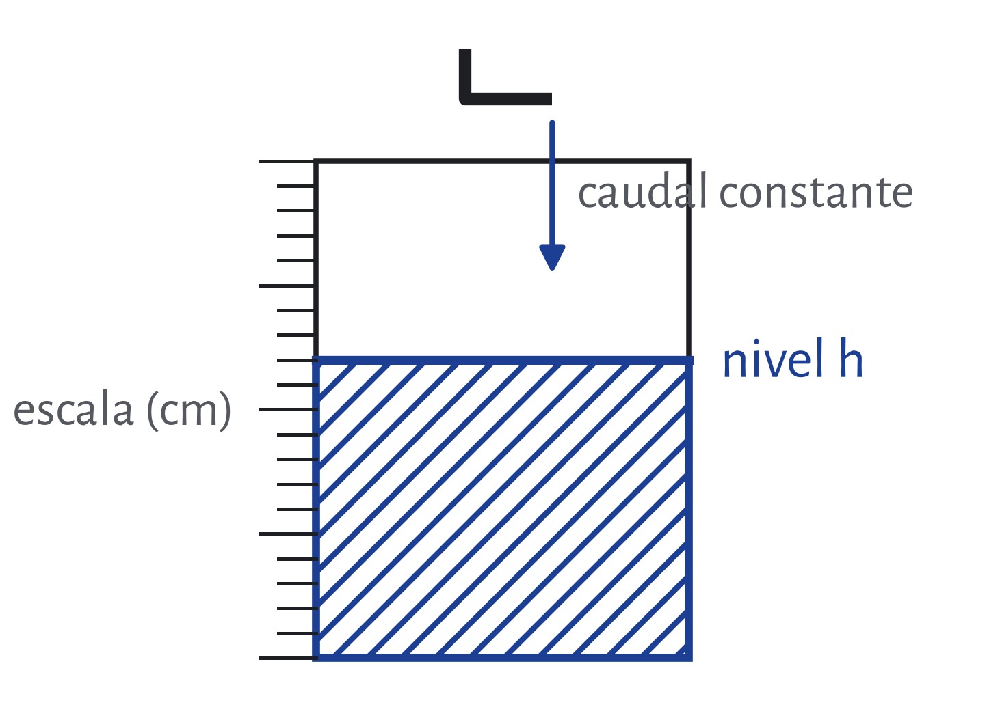
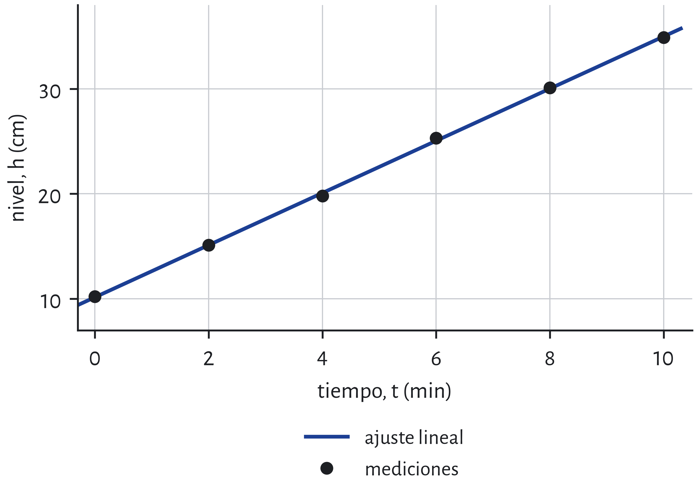

# Objetivo {#sec:objetivo}

Determinar la tasa de variación del nivel de agua de un tanque que se llena con un caudal constante, y estimar cuánto tarda en alcanzar un nivel dado.

# Introducción {#sec:introduccion}

Si una magnitud $y$ cambia con el tiempo $t$ a ritmo constante, su gráfica es una recta y la tasa de variación es la pendiente:

$$\bar{r} = \dfrac{\Delta y}{\Delta t}$$

Cuando las mediciones tienen dispersión, la pendiente se estima ajustando una recta $y = \bar{r}\,t + y_0$ por mínimos cuadrados, y la calidad del ajuste se mide con el coeficiente de determinación $R^2$.

# Descripción de la experiencia {#sec:experiencia}

Se llenó un tanque transparente con un caudal constante y se anotó el nivel del agua sobre una escala adosada cada 2 min, como muestra la .

{#fig:esquema width=11cm}

## Instrumental utilizado

- Cronómetro digital, apreciación $1\ \mathrm{s}$.
- Escala graduada en milímetros, apreciación $1\ \mathrm{mm}$; la incertidumbre de lectura del nivel es de $\pm 0{,}1\ \mathrm{cm}$.
- Tanque transparente y canilla con caudal regulado y constante.

# Presentación de resultados {#sec:resultados}

La  reúne las mediciones y la  las dibuja junto con la recta de ajuste.

::: {#tbl:datos}
| $t$ (min) | $h$ (cm) |
|----------:|---------:|
| 0 | 10,2 |
| 2 | 15,1 |
| 4 | 19,8 |
| 6 | 25,3 |
| 8 | 30,1 |
| 10 | 34,9 |

Table: Nivel de agua $h$ medido cada 2 min.
:::

{#fig:grafico width=11cm}

## Tratamiento de las incertidumbres

El ajuste por mínimos cuadrados da una pendiente $\bar{r} = 2{,}49\ \frac{\mathrm{cm}}{\mathrm{min}}$ con error estadístico $\varepsilon = 0{,}02\ \frac{\mathrm{cm}}{\mathrm{min}}$, que mide la dispersión de los puntos respecto de la recta. El nivel inicial ajustado es $h_0 = 10{,}1\ \mathrm{cm}$ con error $0{,}1\ \mathrm{cm}$.

::: resultado
Tasa de variación del nivel: $\bar{r} = (2{,}49 \pm 0{,}02)\ \dfrac{\mathrm{cm}}{\mathrm{min}}$.

Tiempo para llegar a 60 cm: $t \approx 20{,}1\ \mathrm{min}$.
:::

# Cálculo independiente {#sec:verificacion}

Se repitió el ajuste con un cálculo independiente, en forma simbólica y después con los datos:

- La pendiente y la ordenada coinciden con las del ajuste del procedimiento anterior.
- Las unidades cierran: la pendiente sale en $\frac{\mathrm{cm}}{\mathrm{min}}$ y el tiempo, en minutos.
- Caso límite: si todas las mediciones estuvieran alineadas, $R^2 = 1$ y el error de la pendiente sería nulo.

::: {#tbl:resultados}
| Magnitud | Valor calculado | Con cifras significativas |
|---|---|---|
| $\bar{r}$ | $2{,}4857\ \frac{\mathrm{cm}}{\mathrm{min}}$ | $2{,}49\ \frac{\mathrm{cm}}{\mathrm{min}}$ |
| $h_0$ | $10{,}138\ \mathrm{cm}$ | $10{,}1\ \mathrm{cm}$ |
| $t_{60}$ | $20{,}06\ \mathrm{min}$ | $20{,}1\ \mathrm{min}$ |

Table: Resultados del ajuste y del tiempo estimado.
:::

# Conclusiones {#sec:conclusion}

El nivel crece de forma lineal, con una tasa de $2{,}49\ \frac{\mathrm{cm}}{\mathrm{min}}$ y un ajuste muy bueno (ver ). Con ese ritmo, el tanque llega a 60 cm unos 20,1 min después de iniciada la medición; la estimación vale mientras el caudal se mantenga constante.
